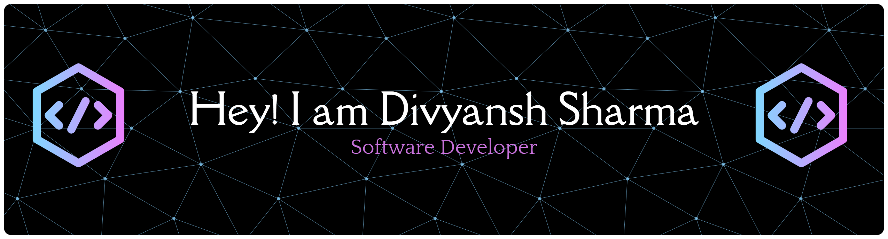

<h3 align="center">Pre-final year IT undergrad @NIT Raipur passionate about building innovative and efficient solutions for digital transformation.</h3>

 
  

- 🔭 I’m currently working on web Technologies and AI/ML
- 📫 How to reach me **divyanshsharma35403@gmail.com**
- 📄 Phone No: +91 7024226251
 
<h2 align="left">Connect with me:</h2>

 

<h2 align="left">Languages and Tools:</h2>

  
  
  
  
  
  
  
  
  
  
  
  
  
  
  
  
  
  
  
  
  
  

<h2>Profile Analysis</h2>

      
  

  

 
<h2>Contributions</h2>
<picture>
  <source media="(prefers-color-scheme: dark)" srcset="https://raw.githubusercontent.com/divyansh884/divyansh884/output/pacman-contribution-graph-dark.svg">
  <source media="(prefers-color-scheme: light)" srcset="https://raw.githubusercontent.com/divyansh884/divyansh884/output/pacman-contribution-graph.svg">
  
</picture>
